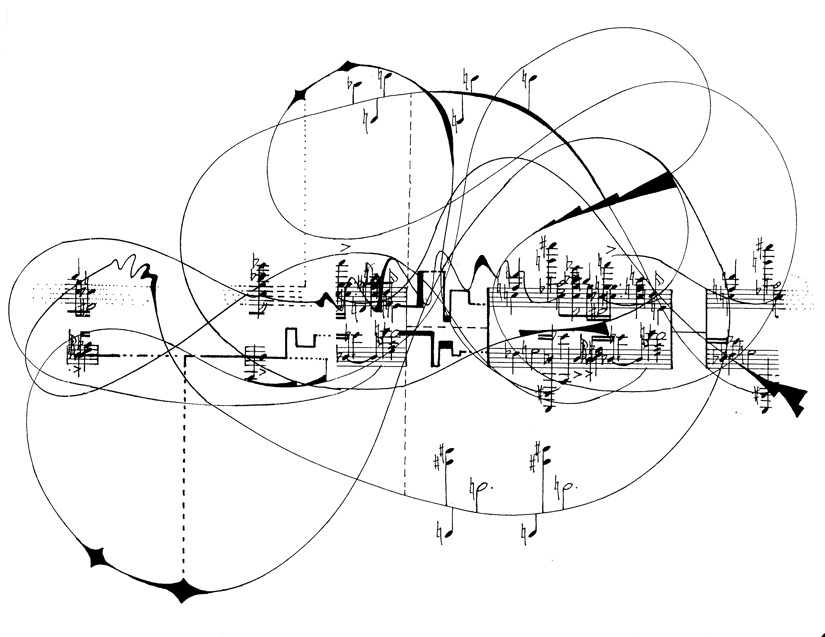

#### An Experimental School of Music 

My project is to produce a new fusionary genre by applying the theoretical principles of jazz harmony to the school of New Complexity. I have created a single composition based on these principles. This site is a repository for all material relevant to this project. 

### [What is New Complexity?](/notes/vault/what-is-new-complexity?.md)

### [What Does the Mind Have To Do With Music?](/notes/vault/what-is-jazz-harmony?.md)

### [What is Jazz Harmony?](/notes/vault/what-is-jazz-harmony?.md)

### [Whence Fusion?](/notes/vault/what-is-jazz-harmony?.md)

### Documentation

[|Journal Entries](/notes/vault/entries.md)  
[|References](/notes/vault/references.md)  
[|Further Readings](/notes/vault/further-readings.md)

### Content List

If you would prefer to navigate the contents of this site through an ordered list as opposed to a graph, please find a provided content list below:

- [All Notes](/notes)

#### Misc. & Troubleshooting

- [Scheduled Maintenance](/notes/vault/maintenance.md)

> __*For questions or matters relating to troubleshooting, shoot me an email:*__ [Email Sam](https://mail.google.com/mail/?view=cm&to=sammeltzerthometz@gmail.com)

