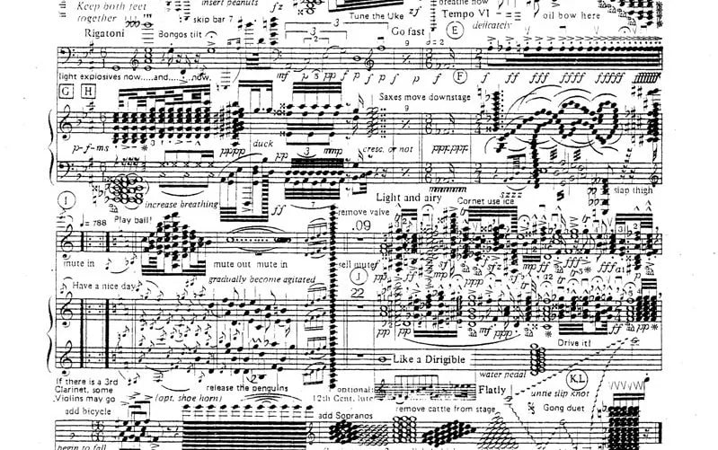

### Enumerated alphabetically:

*Ader, L. (2020). Introduction to Microtonal Music. Microtonal Music in Central and Eastern Europe: Historical Outlines and Current Practices Avtorji Leon Stefanija (Ed) Univerza v Ljubljani, Filozofska Fakulteta Rūta Stanevičiūtė (Ed) Litovska Akademija Za Glasbo in Gledališče, Vilna, Litva. [https://doi.org/10.4312/9789610603122](https://doi.org/10.4312/9789610603122)

*Duncan, S. (2015, April 30). The concept of new complexity: Notation, interpretation and analysis [Cornell University]. Retrieved March 4, 2022, from [https://www.academia.edu/7151765/The_Concept_of_New_Complexity_Notation_Interpretation_and_Analysis_Cornell_University_](https://www.academia.edu/7151765/The_Concept_of_New_Complexity_Notation_Interpretation_and_Analysis_Cornell_University_)

_Herf, F., Maedel, R., & Hesse, H. (2020, May 29). Microtones. Retrieved March 4, 2022, from [https://e-knjige.ff.uni-lj.si/znanstvena-zalozba/catalog/view/217/318/5175-1](https://e-knjige.ff.uni-lj.si/znanstvena-zalozba/catalog/view/217/318/5175-1)

*Toop, R. (1988). Four Facets of The New Complexity. Contact: A Journal for Contemporary Music (1971-1990), (32). [https://doi.org/https://doi.org/10.25602/GOLD.cj.v0i32.1284](https://doi.org/https://doi.org/10.25602/GOLD.cj.v0i32.1284)**

___To be continually appended...___

